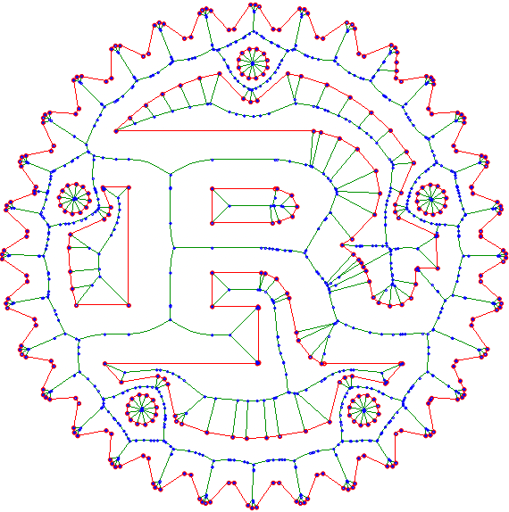

[](https://crates.io/crates/boostvoronoi)
[](https://docs.rs/boostvoronoi)
[](https://github.com/eadf/boostvoronoi.rs/workflows/Rust/badge.svg)
[](https://github.com/eadf/boostvoronoi.rs/workflows/Clippy/badge.svg)
[](https://deps.rs/crate/boostvoronoi/0.8.2)

# Segmented Voronoi for Rust


[Boost 1.75.0 polygon::voronoi](https://www.boost.org/doc/libs/1_75_0/libs/polygon/doc/voronoi_main.htm) ported to 100% rust (nothing voronoi related changed in 1.76)
This implementation of [Fortune's algorithm](https://en.wikipedia.org/wiki/Fortune%27s_algorithm) works on line segments as well as points, making it useful for calculating [centerlines (like the image above)](https://github.com/eadf/toxicblend.rs).

Code still in development, not ready for any purpose.

# Note
The code uses ```#![feature(map_first_last)]``` i.e. rust nightly.



Gui example:
```fish
cargo run --example fltk_gui
```
* Mouse click to place new points. 
* Press and hold 'L' + mouse click to add single line. 
* Press and hold 'S' + mouse click to add strings of lines.
* Use mouse wheel to zoom.
* Mouse click and drag to pan.

API example:
```rust
use boostvoronoi::{Point,Line};
use boostvoronoi::builder::{Builder};
type I1 = i32; // this is the integer input type
type F1 = f64; // this is the float output type (circle event coordinates)

// Only unique Points will be used. Points should not intersect lines
let p = vec![Point{x:9_i32, y:10}];
// Lines may only intersect at the endpoints.
let s = vec![Line::new(Point{x:10_i32, y:11}, Point{x:12, y:13})];
let mut vb = Builder::<I1, F1>::new();

// you will have to keep track of the input geometry. it will be referenced as
// input geometry indices in the output.
vb.with_vertices(p.iter()).unwrap();
vb.with_segments(s.iter()).unwrap();

// this will generate the list of cells, edges and circle events (aka vertices)
let result = vb.construct().unwrap();
```
Edges may become curves when line segments are used as input, see the example code for discretization and interpolation. 

## Todo
- [x] Fix the degenerate vertex key problem
- [ ] Fix the beach-line key problem
- [ ] Error handling
- [X] Evaluate the generic API. Is <I1, F1, I2, F2> really needed?
- [ ] ~Replace~ Verify the builtin ulp implementation
- [x] Replace num::BigInt with something lighter
- [ ] Add many more test cases for voronoi_robust_ftp.rs, specially for ulp
- [x] Remove use of vec_map::VecMap where not absolutely needed.
- [ ] Benchmark and optimize
- [x] Example GUI with more features. fltk?
- [x] Fix the beach-line bug found with main.rs example

All credit goes to the original author ([Andrii Sydorchuk](https://github.com/asydorchuk)) and the [boost contributors](https://github.com/boostorg/polygon), except the porting mistakes. They are all mine.

